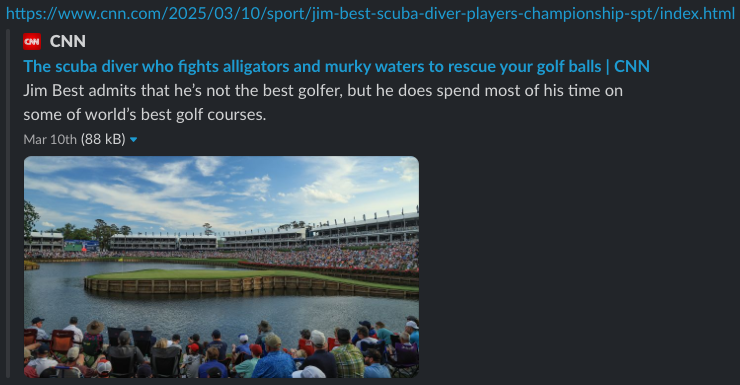

# Serverless oEmbed Provider

[](https://opensource.org/licenses/MIT)
[](https://nodejs.org/)

A **serverless oEmbed provider boilerplate** that enables rich content previews when your content is shared on social media platforms, messaging apps, and other services that support oEmbed.

## What is oEmbed?

oEmbed is the standard used to show rich previews when sharing links. When you share a link on platforms like Slack, Discord, Twitter, or Facebook, they use oEmbed to fetch and display rich content previews.

Example of an oEmbed preview card on Slack for a CNN link:



## Features

- ✅ Complete [oEmbed 1.0](https://oembed.com/) specification compliance
- ✅ Custom domain support with SSL certificates
- ✅ Production monitoring with CloudWatch dashboards
- ✅ Security best practices and input validation
- ✅ Cost-optimized serverless architecture
- ✅ Multi-environment support (dev/staging/prod)

## Quick Start

### Deploy with SAM CLI (Recommended)

```bash
# Clone and setup
git clone https://github.com/aws-samples/serverless-oembed.git
cd serverless-oembed
npm install

# Configure parameters
cp dev.parameters.example dev.parameters
# Edit dev.parameters with your values

# Deploy using helper script (handles parameter formatting automatically)
./deploy.sh dev --guided
```

**See [DEPLOYMENT.md](DEPLOYMENT.md) for detailed instructions.**

## Supported Content Types

- **Video**: Interactive players with iframe embeds and thumbnails
- **Photo**: High-resolution images with responsive sizing
- **Rich**: Interactive widgets and custom HTML content
- **Link**: Simple metadata previews for link sharing

## oEmbed Discoverability

To enable automatic discovery by social platforms and other services, add oEmbed discovery links to your content pages:

### HTML Discovery Tags

Add these `<link>` tags to the `<head>` section of your content pages:

```html
<!-- JSON oEmbed discovery -->
<link
  rel="alternate"
  type="application/json+oembed"
  href="https://your-oembed-endpoint.com/oembed?url=https%3A%2F%2Fyoursite.com%2Fvideo%2F123"
  title="Video Title"
/>

<!-- XML oEmbed discovery (optional) -->
<link
  rel="alternate"
  type="text/xml+oembed"
  href="https://your-oembed-endpoint.com/oembed?url=https%3A%2F%2Fyoursite.com%2Fvideo%2F123"
  title="Video Title"
/>
```

**Note**: The `href` URL must be properly URL-encoded. The `format` parameter is only needed if your endpoint requires it explicitly.

### oEmbed Specification Compliance

This provider is **100% compliant** with the [official oEmbed 1.0 specification](https://oembed.com/):

✅ **Request Parameters**: Supports all official parameters (`url`, `maxwidth`, `maxheight`, `format`)  
✅ **Response Formats**: JSON (default) and XML with proper Content-Type headers  
✅ **Content Types**: All four types (`photo`, `video`, `rich`, `link`) with required fields  
✅ **HTTP Status Codes**: Official error codes (404, 501, 401) as per spec  
✅ **Discovery Methods**: Both HTML `<link>` tags and HTTP Link headers  
✅ **Security**: URL scheme filtering, XSS prevention, proper XML escaping

### Platform Integration

Popular platforms that support oEmbed discovery:

- **Discord**: Automatically detects and displays rich previews
- **Slack**: Shows interactive content previews in messages
- **Twitter/X**: Displays rich media cards
- **Facebook**: Shows enhanced link previews
- **LinkedIn**: Displays professional content previews
- **Reddit**: Shows embedded content in posts

## Backend Integration

Customize `src/integration/getContentMetadata.mjs` to connect to your backend:

```javascript
export async function getContentMetadata(url, params = {}) {
  const contentId = extractContentId(url);
  const content = await fetchContentFromBackend(contentId);

  return {
    type: "video", // or "photo", "rich", "link"
    title: content.title,
    author_name: content.author,
    html: generateEmbedHtml(content),
    width: content.width,
    height: content.height,
  };
}
```

**See [Integration Guide](src/integration/INTEGRATION_GUIDE.md) for detailed instructions.**

## API Usage

Your oEmbed endpoint will be available at:

```
https://your-endpoint/oembed?url=https://yourcompany.com/content/123
```

Example response:

```json
{
  "version": "1.0",
  "type": "video",
  "title": "Sample Video",
  "provider_name": "Your Company",
  "html": "<iframe src='...' width='800' height='450'></iframe>",
  "width": 800,
  "height": 450
}
```

## Expected Costs

This serverless architecture is designed to be cost-effective for most use cases:

### Basic Deployment (Default Configuration)

- **AWS Lambda**: ~$0.20-1.00/month for typical usage (1,000-10,000 requests)
- **API Gateway**: ~$0.35-3.50/month (1,000-10,000 requests)
- **CloudWatch Logs**: ~$0.50-2.00/month
- **Custom Domain** (optional): ~$0.50/month for Route 53 hosted zone
- **Total**: **~$1.50-7.00/month** for typical small to medium usage

### High-Traffic Deployment (With Caching Enabled)

- **Basic costs**: ~$1.50-7.00/month
- **API Gateway Cache** (0.5GB): ~$13.50/month
- **Total**: **~$15.00-20.50/month** for high-traffic scenarios

### Cost Optimization Tips

- **Start without caching** - Enable only when you exceed 1,000+ requests/day
- **Monitor usage** - Use CloudWatch dashboards to track actual costs

## Local Development

```bash
# Clone and setup
git clone https://github.com/aws-samples/serverless-oembed-provider.git
cd serverless-oembed-provider
npm install

# Test locally
sam build
sam local start-api --env-vars test-env.json
curl "http://localhost:3000/oembed?url=https://yourdomain.com/video/123"

# Run tests
npm test
```

## Support

- **Examples**: [oEmbed response examples](./examples/) for inspiration
- **Deployment**: [Deployment Guide](DEPLOYMENT.md) for detailed deployment instructions
- **Integration**: [Integration Guide](src/integration/INTEGRATION_GUIDE.md) for backend integration
- **Issues**: [GitHub Issues](https://github.com/aws-samples/serverless-oembed-provider/issues) for support

## Contributing

We welcome contributions! Please see [CONTRIBUTING.md](CONTRIBUTING.md) for guidelines.

## License

This project is licensed under the MIT License - see the [LICENSE](LICENSE) file for details.
